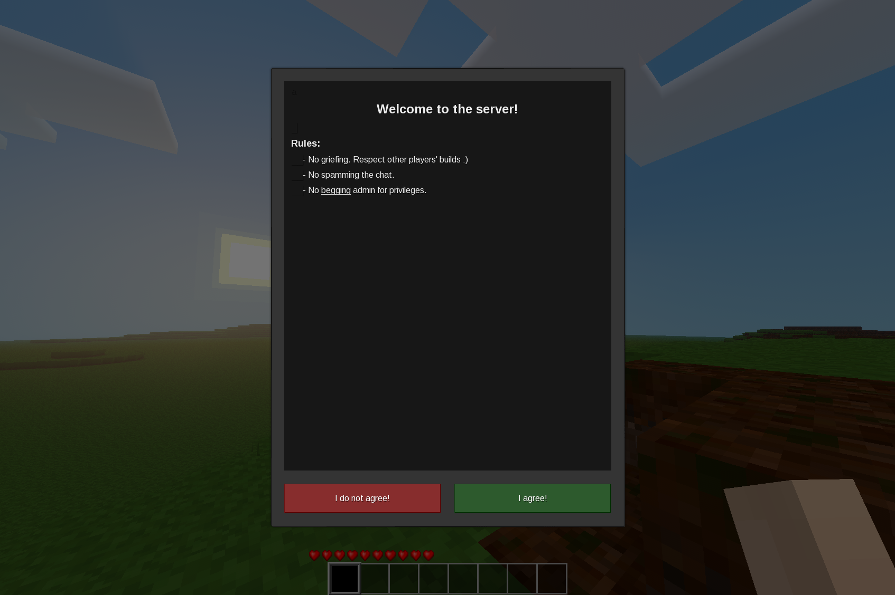

# Server Rules

A mod for [Luanti](https://luanti.org) that adds a rules interface.

## Features:

- Supports hypertext formatting
- Rules can be modified using `/set_rules`
- Split-screen GUI to set the rules allows previewing the formatted hypertext
- Rules are saved to `rules.txt` in the worldpath
- Players must agree to the rules when they join for the first time to gain interact

## Licenses

Source code is licensed under the MIT license.
